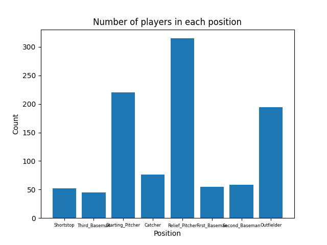
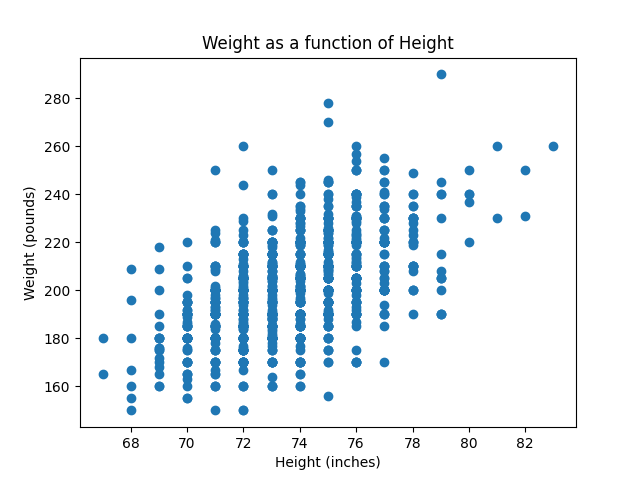

# Polars decription and visualization

Using the polars libary was able to load, decribe, and plot various visulaztions of a basebal data set.

Histogram of players in each position:

Scatter of heights vs weights of each player:

